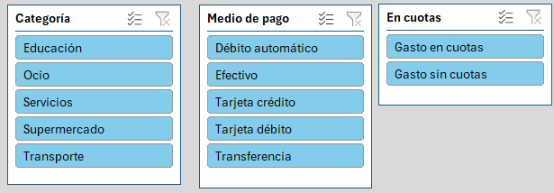
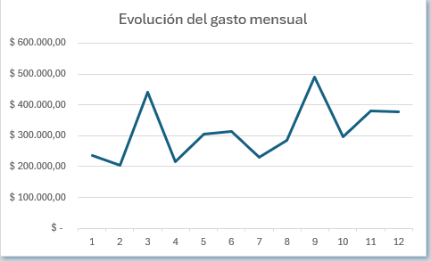
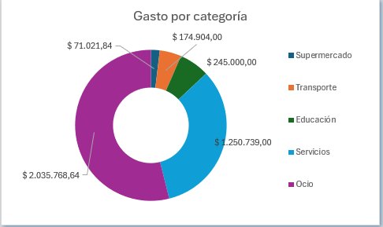
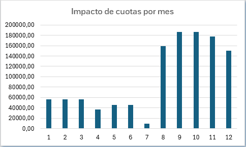
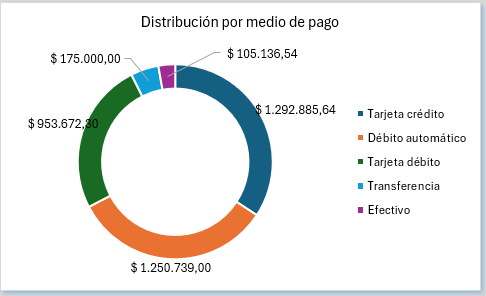

# 📊 Análisis de Gastos Personales 2025 (Excel Dashboard)

## 🧾 Descripción del Proyecto

Este proyecto consiste en el análisis de **mis gastos personales durante el año 2025**, utilizando **Microsoft Excel** como herramienta principal.  
El objetivo es transformar datos transaccionales en **KPIs claros y un dashboard interactivo**, aplicando buenas prácticas de análisis de datos y visualización.

El análisis no se limita al gasto total, sino que profundiza en:
- Evolución mensual del gasto
- Distribución por categorías
- Medios de pago
- Impacto de las compras en cuotas

---

## 🎯 Objetivos

- Analizar el comportamiento de gastos a lo largo del año
- Identificar meses y categorías con mayor gasto
- Medir el impacto de las compras en cuotas
- Construir un **dashboard interactivo en Excel**
- Practicar criterios de análisis y diseño orientados a un portfolio de Data Analyst

---

## 🗂 Descripción del Dataset

El dataset representa **todos los gastos realizados durante 2025**, con las siguientes columnas:

- `Fecha`
- `Categoría`
- `Descripción`
- `Monto`
- `Medio de pago`
- `En cuotas` (Sí / No)
- `N° de cuota`
- `Total cuotas`
- Columnas derivadas:
  - `Mes`
  - `Año`
  - `Mes-Año`

### Categorías de gastos
- Transporte (Sube, Uber)
- Supermercado
- Servicios (Luz, Agua, Gas, Cable, Teléfono)
- Salud
- Educación
- Ocio (ropa, salidas, electrónicos, etc.)

---

## 🛠 Herramientas y Técnicas Utilizadas

- Microsoft Excel
- Tablas dinámicas (Pivot Tables)
- Gráficos dinámicos (Pivot Charts)
- Segmentadores (Slicers)
- Funciones:
  - `GETPIVOTDATA`
  - `XLOOKUP`
  - `FILTER`
  - `IFERROR`
- Tarjetas KPI vinculadas a celdas
- Diseño de dashboard orientado a análisis

---

## 📐 Estructura del Archivo

```
## 🗂️ Archivo Excel
│   ├── gastos_2025_dataset → Datos originales
│   ├── tablas_dinamicas → Tablas dinámicas base
│   ├── kpis → Cálculo de KPIs
│   └── dashboard → Dashboard final
```

---

Esta estructura permite:
- Separación clara entre datos, lógica y visualización
- Mayor mantenibilidad
- Escalabilidad del proyecto

---

## 📊 KPIs Principales

- Gasto total anual
- Promedio mensual de gasto
- Mes con mayor gasto
- Porcentaje del gasto realizado en cuotas
- Mes con mayor impacto de cuotas

Algunos KPIs son **globales** (contexto anual) y otros son **dinámicos**, reaccionando a los segmentadores, siguiendo criterios reales de diseño de dashboards.

---

## 🎛 Interactividad

El dashboard incluye **segmentadores** que permiten filtrar por:
- Categoría de gasto
- Medio de pago
- Compras en cuotas (Sí / No)



Todos los gráficos y KPIs relevantes están conectados a estos segmentadores, permitiendo un análisis flexible e interactivo.

Los KPIs incluyen **manejo de errores**, evitando resultados incorrectos cuando los filtros dejan períodos sin datos.

---

## 🖼 Dashboard y Visualizaciones

### 📈 Evolución del gasto mensual


### 🧾 Gasto por categoría


### 💳 Impacto de las cuotas por mes


### 💼 Distribución por medio de pago


---

## 🧠 Principales Insights

- Los gastos de ocio representan el **componente más alto del gasto total**, con una presencia constante a lo largo del año.
- Las compras en cuotas comienzan a tener un **impacto significativo a partir de la segunda mitad del año**, concentrándose especialmente en gastos de alto monto.
- Al analizar los gastos por categoría, se observa que **el medio de pago utilizado es altamente consistente**: en la mayoría de las categorías predomina un único medio de pago durante todo el año, lo que sugiere hábitos de consumo bien definidos.
- De misma forma, al filtrar por medio de pago se mantiene una **estructura de gasto estable**, con categorías claramente asociadas a ciertos medios.

---

## 🚀 Conclusión

Este proyecto demuestra:
- Dominio sólido de Excel
- Pensamiento analítico
- Diseño de KPIs con criterio de negocio
- Construcción de dashboards interactivos
- Buenas prácticas de organización y mantenimiento

Fue desarrollado como **proyecto de portfolio**, orientado a roles de **Data Analyst / Business Analyst junior**.

---

## 📌 Próximos Pasos (Mejoras Futuras)

- Migrar el análisis a Power BI o Python
- Incorporar comparaciones interanuales
- Automatizar la carga de datos
- Agregar métricas de ahorro o presupuesto
